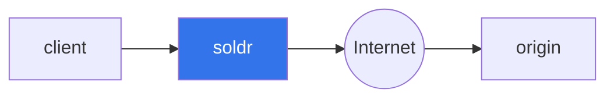
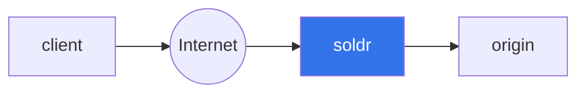

# soldr

Soldr is a layer 7 (HTTP) proxy designed to provide resiliency to webbook requests.

> ***Note***
> Soldr is still under active development.

Soldr includes functionality to improve the resiliency of webhook requests, including:
- retrying requests that fail.
- sending alerts for requests that fail a certain number of retries.
- editing of the request headers and body.

Soldr can be used as a foward proxy to add resiliency to the client sending webhook requests or a reverse proxy to add resiliency to the origin receiving the webhook request.

## Forward Proxy
Clients that send web requests directly to an origin can instead send the requests to soldr. Soldr will log the request and send it to the origin.

Some common use cases that soldr will solve:
- Soldr will retry requests if the origin is unhealthy or if there is a network error.
- Soldr will send alerts for requests that fail a certain number of retries.
- Soldr allows the request headers and body to be edited if the origin rejects the request.

## Reverse Proxy
Origins that receive webhook requests directly from the client can instead have the requests send to soldr. Soldr will log the request and send it to the origin.

Some common use cases that soldr will solve:
- Soldr immediately logs all incoming webhook requests so you never drop a request.
- Soldr will retry any requests that fail at the origin.
- Soldr allows requests to be edited in case the client sends a malformed request.

## Comparisons
### AWS EventBridge
AWS EventBridge enables event sourcing by transforming webhooks or API calls into events. Events are stored in a log and can be replayed. Events that contain incorrect data can be edited by using input transformation, but input transformation was not designed to support ad-hoc editing of event data.

Soldr has no opinions on event sourcing. Instead, soldr aims to be a transparent proxy that provides resiliency to your incoming webhook requests. If your internal architecture already uses event sourcing, then you may not need soldr.

## Basic Example

Start the provided origin server: `cargo run --example origin`

In a separate terminal window, start soldr: `RUST_LOG=soldr=trace cargo run`

In a separate terminal window, run the following curl requests:

Map an origin:

```
curl -vvv -H "Content-Type: application/json" localhost:3443/origins \
-d '{ "domain": "example.wh.soldr.dev", "origin_uri": "http://localhost:8080" }'
```

Send a request that will succeed:

```
curl -vvv -H "Host: example.wh.soldr.dev" localhost:3000/ -d ''
```

Send a request that will failure:

```
curl -vvv -H "Host: example.wh.soldr.dev" localhost:3000/failure -d ''
```

This request will be retried repeatedly by the retry queue.


In the terminal window running soldr, you will see a lot of tracing output that demonstrates how soldr is running.

## Design

Soldr is designed to be used with webhooks that pass messages to an origin and only except acknowledgement of the request. [Shopify Webhook](https://shopify.dev/docs/apps/webhooks) are a good example of these types of webhooks. Webhooks that except a response body based on the request payload are not a good fit for Soldr. [Dialogflow CX Webhooks](https://cloud.google.com/dialogflow/cx/docs/concept/webhook) are an example of the types of webhook implementations that soldr is not designed to support.

## License

Licensed under either of
 * Apache License, Version 2.0 ([LICENSE-APACHE](LICENSE-APACHE) or http://www.apache.org/licenses/LICENSE-2.0)
 * MIT license ([LICENSE-MIT](LICENSE-MIT) or http://opensource.org/licenses/MIT)
at your option.

### Contribution

Unless you explicitly state otherwise, any contribution intentionally submitted
for inclusion in the work by you, as defined in the Apache-2.0 license, shall be dual licensed as above, without any
additional terms or conditions.
