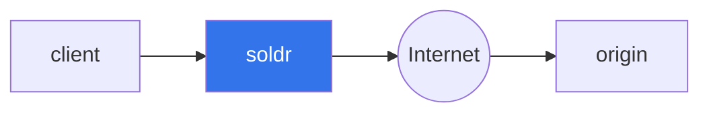
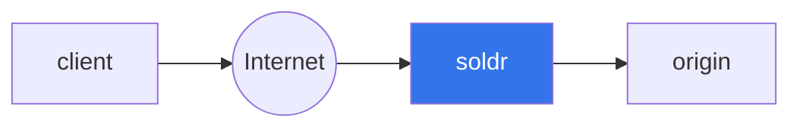

# soldr

Soldr is a layer 7 (HTTP) proxy designed to provide resiliency to HTTP requests.

> [!NOTE]
> Soldr is still under active development.

Soldr includes functionality to improve the resiliency of HTTP requests, including:
- retrying requests that fail.
- sending alerts for requests that fail a certain number of retries.
- editing of the request headers and body.

Soldr can be used as a foward proxy to add resiliency to the client sending HTTP requests or a reverse proxy to add resiliency to the origin receiving the HTTP request.

## Forward Proxy
Clients that send web requests directly to an origin can instead send the requests to soldr. Soldr will log the request and send it to the origin.

Some common use cases that soldr will solve:
- Soldr will retry requests if the origin is unhealthy or if there is a network error.
- Soldr will send alerts for requests that fail a certain number of retries.
- Soldr allows the request headers and body to be edited if the origin rejects the request.

## Reverse Proxy
Origins that receive HTTP requests directly from the client can instead have the requests send to soldr. Soldr will log the request and send it to the origin.

Some common use cases that soldr will solve:
- Soldr immediately logs all incoming HTTP requests so you never drop a request.
- Soldr will retry any requests that fail at the origin.
- Soldr allows requests to be edited in case the client sends a malformed request.

## Basic Example

Start the example origin server: `cargo run --example origin`

In a separate terminal window, start soldr: `RUST_LOG=soldr=trace cargo run`

In a separate terminal window, run the following curl requests:

Create an origin so soldr knows how to route incoming requests:

```
curl -vvv -H "Content-Type: application/json" localhost:3443/origins \
-d '{ "domain": "example.wh.soldr.dev", "origin_uri": "http://localhost:8080" }'
```

Send a request that will succeed:

```
curl -vvv -H "Host: example.wh.soldr.dev" localhost:3000/ -d ''
```

Send a request that will fail:

```
curl -vvv -H "Host: example.wh.soldr.dev" localhost:3000/failure -d ''
```

This request will be retried repeatedly by the retry queue.


In the terminal window running soldr, you will see a lot of tracing output that demonstrates how soldr is running.

## Use Cases

- You have a service that sends transactional emails to an email service provider (ESP) and your ESP has planned (or unplanned!) downtime. Soldr will alert you, queue your messages and retry them until the service comes back up.
- You have a service calls an important webhook run by a third party. The third party contacts you and requests that you re-send some webhook requests that they lost. Soldr keeps a record of completed requests that can be replayed by calling an API or using the UI.
- A third party calls your webhook. A code change on their end causes the request body to be invalid causing many requests to fail. You contact them and they revert the change, but they have no way to replay the requests that failed. Soldr allows you to edit the request body of the failed requests and replay them.

## Design

Soldr is designed to be used with HTTP requests that pass messages to an origin and only expect acknowledgement of the request. [Shopify Webhooks](https://shopify.dev/docs/apps/webhooks) are a good example of these types of HTTP requests. HTTP requests that expect a response body based on the request payload are not a good fit for Soldr. [Dialogflow CX Webhooks](https://cloud.google.com/dialogflow/cx/docs/concept/webhook) are an example of the types of implementations that soldr is not designed to support.

## Comparisons
### AWS EventBridge
AWS EventBridge enables event sourcing by transforming HTTP requests into events. Events are stored in a log and can be replayed. Events that contain incorrect data can be edited by using input transformation, but input transformation was not designed to support ad-hoc editing of event data.

Soldr has no opinions on event sourcing. Instead, soldr aims to be a transparent proxy that provides resiliency to your incoming HTTP requests. If your internal architecture already uses event sourcing, then you may not need soldr.

## License

Soldr is licensed under the [Elastic License 2.0 (ELv2)](https://github.com/hjr3/soldr/blob/master/LICENSE.md) license because it provides the best balance between freedom and protection. The ELv2 license is a permissive license that allows you to use, modify, and distribute soldr as long as you follow a few simple rules:

1. **You may not provide soldr to others as a managed service.** For example, you _cannot_ host soldr yourself and sell it as a cloud-based licensing service. However, you _can_ sell a product that directly exposes and utilizes soldr, as long as soldr cannot be used outside of your product for other purposes.

1. **You may not circumvent the license key functionality or remove/obscure features protected by license keys.** You _cannot_ remove or change the licensing code to, for example, unlock a paid/enterprise feature.

1. You may not alter, remove, or obscure any licensing, copyright, or other notices.

Anything else is fair game. There's no clause that requires you to open source modifications made to soldr or other derivative works. You can fork soldr and go closed-source.

### Contribution

Unless you explicitly state otherwise, any contribution intentionally submitted
for inclusion in the work by you, as defined in the Apache-2.0 license, shall be dual licensed as above, without any
additional terms or conditions.
